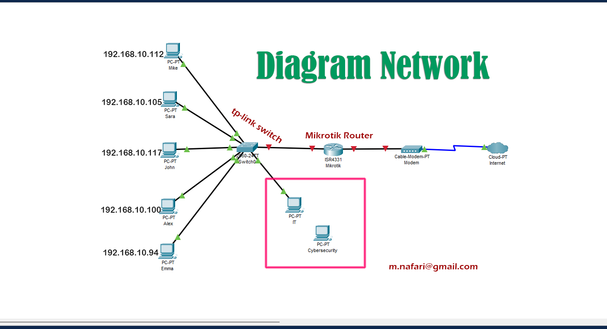
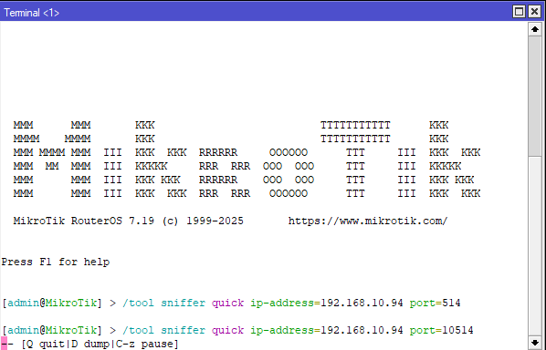
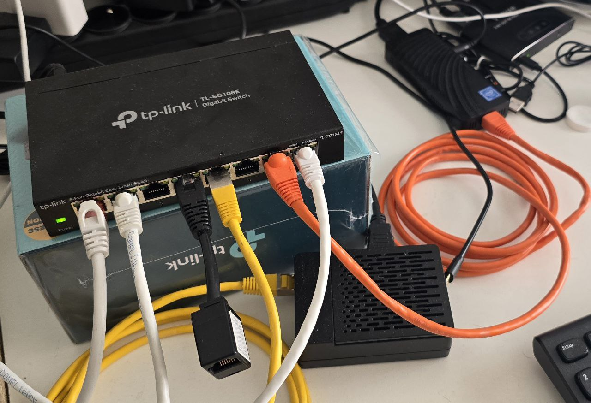
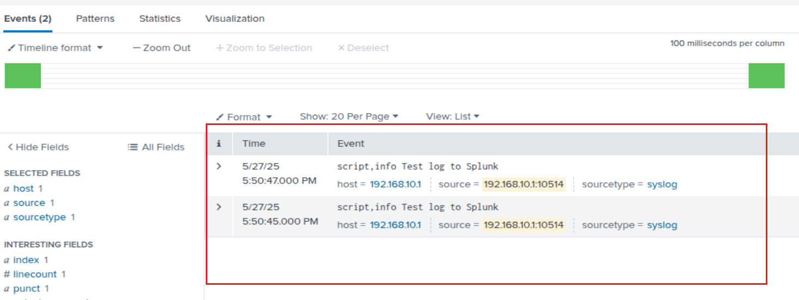
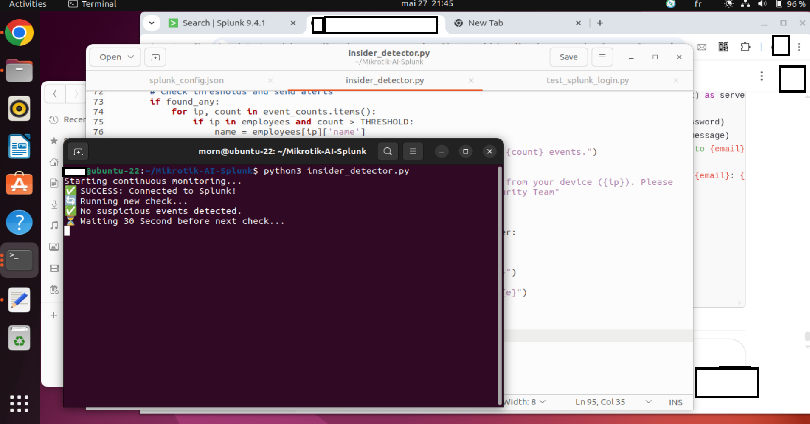
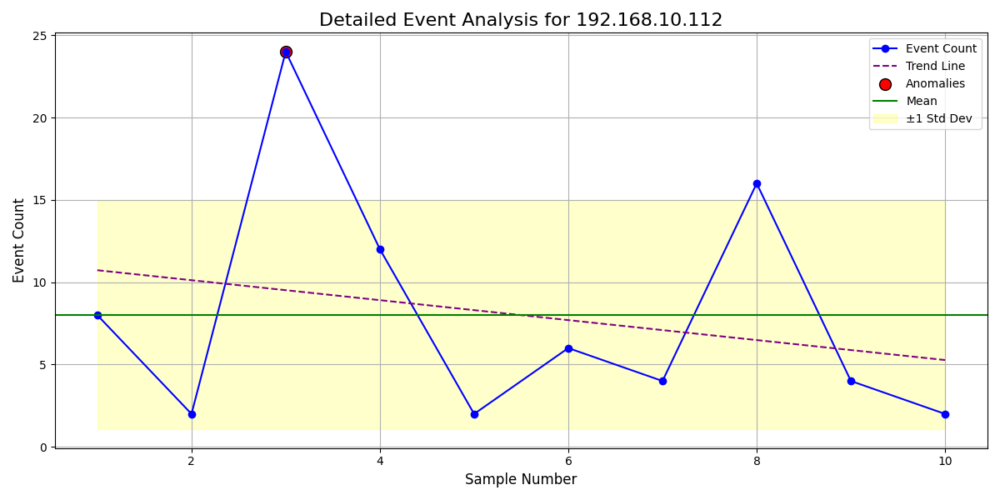

# Identifying Disgruntled Employee Behavior Across the Company Using Mikrotik, AI & Splunk by cybersecurity team

## Project Name

**Mikrotik-AI-Splunk**

---

## ⚠ Disclaimer

* All IP addresses and employee names used in this project are **fictional** and meant only for demonstration.
* This project is intended for educational and research purposes only.

---

## 📊 Overview

This experimental project showcases how to detect suspicious or abnormal employee behavior across an entire company, using:

* **Mikrotik Router** for collecting network traffic logs.
* **TP-Link Switch** for network distribution.
* **Splunk Enterprise** for log indexing and searching.
* **Python scripts** with integrated AI/ML models to analyze employee behaviors in real time.

> 

### Key Use Case

The goal is to enable cybersecurity teams to monitor internal network activities (such as repeated pings, abnormal traffic patterns) and identify employees who may be acting outside normal behavior patterns, potentially indicating dissatisfaction, frustration, or insider threats across the organization.

---

## 🖥️ Hardware Setup

* **Mikrotik Router** → Central network manager, sending syslog to Splunk.

  > 

* **TP-Link Switch (TL-SG108E)** → Distributes internal connections.

  > 

* **Employee Devices** → Example IPs and names:
  \| Name  | IP Address        |
  \|-------|-------------------|
  \| Alex  | 192.168.10.100    |
  \| Sara  | 192.168.10.105    |
  \| Mike  | 192.168.10.112    |
  \| John  | 192.168.10.117    |
  \| Emma  | 192.168.10.94     |

> More photos and screenshots can be found in the `photo/` folder.

---

## 🔧 Splunk Configuration

We configured Splunk to receive syslog data over UDP from Mikrotik:

* Splunk settings → Data Inputs → UDP Listener (e.g., port 10514)
* Mikrotik → Logging rules to forward logs to Splunk's server IP

> 

---

## 🐍 Python Scripts Overview

There are two main scripts in this project:

✅ **insider\_detector.py** → Collects and counts events from Splunk.

> 

✅ **ai\_ml\_detector.py** → Runs anomaly detection models and produces visual plots.

> 

> For full visual samples, check the `photo/` directory.

---

## 🤖 AI & Machine Learning Integration

We apply simple machine learning (currently Isolation Forest, expandable later) to detect unusual activity patterns:

* Identify spikes or anomalies in event counts.
* Generate visual graphs marking outlier points.
* Build a foundation for advanced time-series or behavioral analysis in real-world settings.

> 

With richer real-world data, the system could evolve to provide even stronger, dynamic diagrams and behavioral profiles, enabling the cybersecurity team to identify disgruntled or risky employees throughout the entire organization.

---

## 🚀 How to Run

1. Install Python dependencies:

```bash
pip install -r requirements.txt
```

2. Configure Splunk and Mikrotik for log forwarding.
3. Run the scripts:

```bash
python3 insider_detector.py
python3 ai_ml_detector.py
```

4. Check console alerts and the `plots/` folder for results.

---

## 🔮 Future Improvements

* Upgrade to advanced ML models (One-Class SVM, LSTM).
* Add real-time alerts via Slack, email, or dashboards.
* Expand detection to include various network activities beyond pings.
* Build an interactive SOC dashboard.

---

## ✉ Contact

M. Nafari
Email: **[m.nafarai@gmail.com](mailto:m.nafarai@gmail.com)**

For additional diagrams, configurations, and detailed screenshots, visit the repository's `photo/` branch or folder.

---

This README is designed to provide a professional, structured introduction for sharing and publishing this project on GitHub.

